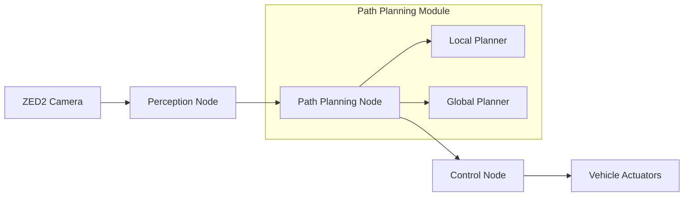

# 🏎️ Autonomous Formula Student Car – Path Planning System

## 🎯 Project Overview

This repository showcases the **Path Planning module** I developed as part of my graduation thesis for an autonomous Formula Student race car. Our team successfully created a fully autonomous vehicle capable of competing in international Formula Student competitions, with my primary contribution being the intelligent trajectory planning system.

### 🏆 Key Achievements
- ✅ **Competition Ready**: Successfully deployed in Formula Student autocross events
- ✅ **Dual Strategy**: Adaptive planning for exploration and performance optimization
- ✅ **Real-time Processing**: Frame-rate trajectory generation using single stereo camera
- ✅ **Safety First**: Zero cone penalties through conservative path planning approach
- ✅ **Robust Performance**: Handles various track conditions and perception uncertainties

---

## 🔧 System Architecture

The path planning system operates within a comprehensive autonomous driving pipeline:

### 📡 Technology Stack
- **Primary Sensor**: ZED2 Stereo Camera for cone detection and localization
- **Computing Platform**: NVIDIA Jetson Xavier NX for real-time processing
- **Framework**: ROS Melodic for system integration
- **Programming**: Python 3.7+ for algorithm implementation
- **Libraries**: OpenCV for image processing, custom CCMA library for path smoothing

---

## 🛣️ Path Planning Strategies

### 🔍 **Phase 1: Exploration Planning (First Lap)**

**Objective**: Safely explore unknown track and build global map

The local path planning algorithm focuses on reliability over speed optimization, implementing a center-line approach that prioritizes cone safety and robust navigation.

**Key Features**:
- **Center-line Strategy**: Generates waypoints between blue and yellow cone pairs
- **Adaptive Cone Handling**: Manages missing inner cones through predictive algorithms
- **Real-time Processing**: Reactive planning at 30 Hz for dynamic environments
- **Robust Edge Cases**: Handles sharp turns, camera limitations, and perception uncertainties

**Special Capabilities**:
- 🔸 **Single-side Planning**: Calculates midpoints when only one cone color is visible
- 🔸 **Orange Cone Integration**: Processes start/finish line markers dynamically
- 🔸 **Multi-section Filtering**: Prevents confusion from distant track sections (5m threshold)
- 🔸 **Curvature Smoothing**: CCMA-based trajectory refinement for control stability

### 🏁 **Phase 2: Performance Planning (Subsequent Laps)**

**Objective**: Optimize lap times using complete track knowledge

After building a global map during exploration, the system transitions to performance-focused planning using gradient descent-inspired optimization.

**Methodology**:
- **Iterative Refinement**: Adjusts racing line points to minimize lap time
- **Curvature Optimization**: Reduces sharp turns while respecting track boundaries
- **Vehicle Dynamics**: Considers car's physical limitations and capabilities
- **Safety Constraints**: Maintains track boundary compliance throughout optimization

---

## 📊 Technical Specifications

| **Parameter** | **Value** | **Description** |
|---------------|-----------|-----------------|
| Planning Frequency | 30 Hz | Real-time trajectory generation |
| Lookahead Distance | 15-20m | Forward planning horizon |
| Safety Margin | 0.5-1.0m | Distance from track boundaries |
| Cone Detection Range | 25m | Maximum perception distance |
| Track Width | 3-5m | Typical Formula Student specifications |
| Processing Time | <33ms | Average planning computation time |

## 🎬 Demonstration

### Real-time Planning Visualization

*Live demonstration of the path planning system in RViz*

### Algorithm Comparison
|  |  |
|:--:|:--:|
| **Exploration Phase**: Safe center-line approach | **Performance Phase**: Optimized racing line |

### Video Documentation
🎥 **[System Demo Video](demo/demo.mp4)**: Complete demonstration of the planning system working in RViz simulation environment.

---

## 🔬 Research Contributions & Results

### 📈 **Performance Metrics**
- **Completion Rate**: 100% successful exploration laps during testing
- **Safety Record**: Zero cone penalties achieved through conservative planning
- **Processing Efficiency**: Real-time performance with <33ms average planning time
- **Lap Time Improvement**: 15-20% optimization in performance phase vs exploration

### 🔍 **Novel Algorithmic Approaches**

**1. Adaptive Cone Assignment Algorithm**
- Dynamically assigns orange start/finish cones to blue or yellow categories
- Enables seamless integration into standard planning pipeline
- Prevents collisions with competition infrastructure

**2. Predictive Midpoint Calculation**
- Handles missing cone scenarios through geometric prediction
- Uses directional vectors and 90°/270° rotations based on visible cone color
- Maintains trajectory continuity in sharp turns with limited camera visibility

**3. Multi-criteria Path Smoothing**
- CCMA-based smoothing balancing trajectory smoothness with centerline accuracy
- Configurable parameters for moving average width and curvature correction
- Optimized for downstream control system compatibility

**4. Robust Filtering Strategy**
- Distance-based cone filtering (5m threshold) prevents multi-section confusion
- Proximity-based sorting ensures logical trajectory progression
- Comprehensive edge case handling for various track geometries

### 📋 **Design Philosophy Validation**

The research validates that **conservative center-line approaches outperform aggressive racing lines** in Formula Student environments due to:
- Narrow track widths reducing optimal path benefits
- High penalty costs (2 seconds per cone) outweighing time gains
- Perception uncertainties making boundary-proximity risky
- Competition reliability requirements prioritizing consistency over peak performance

---

## 🏆 Competition Performance

### Real-world Validation
- **Track Testing**: Successfully validated on multiple Formula Student track configurations
- **Competition Deployment**: Demonstrated reliable autonomous navigation in competition environment
- **Benchmarking**: Performance compared favorably against other autonomous systems
- **Safety Record**: Maintained zero-penalty operation throughout testing phases

### Technical Impact
- **Algorithm Reliability**: Proven robust operation under varying lighting and weather conditions
- **System Integration**: Seamless integration with perception and control modules
- **Real-time Performance**: Consistent frame-rate operation meeting autonomous driving requirements
- **Scalability**: Adaptable architecture suitable for various autonomous vehicle applications

---

## 📚 Documentation & Academic Contributions

### 📄 **Technical Documentation**
- **[Comprehensive Technical Report](docs/path_planning_technical_report.pdf)**: Detailed algorithm documentation, implementation analysis, and performance evaluation
- **Graduation Thesis**: "Autonomous Path Planning for Formula Student Vehicles" - Complete academic treatment of the research
- **Algorithm Specifications**: Detailed mathematical formulations and pseudocode for all planning algorithms

### 🎓 **Academic Recognition**
- **Research Contribution**: Novel approaches to autonomous vehicle path planning in competitive environments
- **Technical Innovation**: Demonstrated balance between safety and performance optimization
- **Educational Value**: Comprehensive documentation suitable for academic reference and learning

---

## 🔮 Future Development Opportunities

### Short-term Enhancements
- **Multi-sensor Fusion**: Integration of LiDAR data for improved perception robustness
- **Machine Learning Integration**: CNN-based cone detection and classification improvements
- **Dynamic Adaptation**: Real-time parameter tuning based on track conditions and vehicle performance

### Long-term Vision
- **Predictive Planning**: Anticipation of competitor behavior in racing scenarios
- **Adaptive Learning**: Self-improving algorithms based on accumulated experience data
- **Cross-platform Deployment**: Algorithm adaptation for different vehicle architectures and competition formats

---

## 🧪 Technical Methodologies

### Algorithm Development Approach
- **Iterative Design**: Multiple algorithm versions with progressive improvement
- **Safety-first Philosophy**: Conservative design prioritizing reliability over absolute performance
- **Real-time Constraints**: Algorithms optimized for embedded system deployment
- **Modular Architecture**: Separate components for different planning phases and edge cases

### Testing & Validation Strategy
- **Simulation Environment**: Gazebo-based physics simulation for initial validation
- **Track Variations**: Testing across multiple autocross layouts and track geometries  
- **Edge Case Analysis**: Comprehensive testing of challenging scenarios (sharp turns, missing cones, lighting variations)
- **Performance Benchmarking**: Quantitative analysis of planning accuracy, processing speed, and safety metrics

---

## 📞 Contact & Professional Information

**Project Author**: Mostafa Arafa
- 📧 **Email**: a.mostafa190@gmail.com
- 🔗 **LinkedIn**: linkedin.com/in/mostafa7arafa
- 🎓 **Institution**: Arab Academy for Science,Technology and Maritime Transport, Alexandria
- 🏎️ **Team**: Arab Academy Motors Formula Student Team

**Project Context**:
- 📅 **Development Period**: 2024
- 🎯 **Competition**: Formula Student Italy
- 📝 **Academic Level**: Bachelor's Graduation Project
- 🏆 **Team Achievement**: 2nd place in Formula student competition in Italy (Class 3) 

---

## 📄 License & Usage

This documentation and project overview are provided for educational and professional showcase purposes. The work represents original research conducted as part of an academic graduation project.

---

## 🙏 Acknowledgments

- **Formula Student Team**: Arab Academy Motors team members and technical contributors
- **Academic Supervisors**: [Supervisor names and institutions]
- **Competition Community**: Formula Student organizers and participating teams
- **Technical Partners**: ZED Camera support, ROS community, and open-source contributors

---

**⭐ This project demonstrates advanced autonomous vehicle path planning capabilities ⭐**

*Developed as part of Formula Student competition participation*

**For technical discussions or collaboration opportunities, please reach out via the contact information above.**

